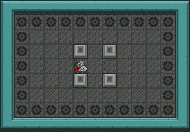
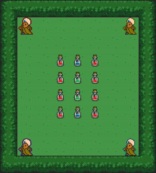
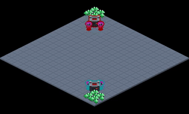

# Griddly CoG 2021 Tutorial
Code for the 2021 Griddly Tutorial at Conference on Games 20th August 2021

# Environment setup

Before trying out the examples here, you need to set up your python environment.

The best way to do that is to use a conda environment as described below

## First create a conda environment with python 3.8

```
conda env create --name griddly_tutorial python==3.8
conda activate griddly_tutorial
pip install -r requirments.txt
```


# Tutorial Examples

## Single Agent - Sokoban

Classic game of sokoban, push boxes into holes!



This environment introduces the following mechanics:
* Single Agent
* Movement 
* Interacting with other objects
* Rewards
* Removing objects

```
sokoban.yaml -> the GDY description file of the game
single-agent-sokoban.py -> a gym environment example showing rendering of the environment and random actions
single-agent-sokoban-rllib.py -> Using RLLib to train a sokoban agent with PPO
```

## Multi Agent - Foragers

A collaborative game where agents collect potions of various strengths



This environment introduces the following mechanics:
* multi-agent 
* ego-centric partial observability (the "camera" follows each agent individually)
* collectible resources (different potions have different values)

```
foragers.yaml -> the GDY description file of the game
multi-agent-foragers.py -> a gym environment example showing rendering of the environment and random actions
multi-agent-foragers-rllib.py -> Using RLLib to train multiple units agent with shared policy
```

## RTS/Strategy - Griddly RTS




A competitive game where you control multiple units against an adversary

This environment introduces the following mechanics:
* multi-agent
  * Self-play reinforcement learning 
* Player global variables
  * Player collects resources to use in the game
* Unlockable units and actions 
  * Different buildings give access to different units)
* Durative actions and events
* Isometric rendering

```
griddly_rts.yaml -> the GDY description file of the game
griddly-rts.py -> a gym environment example showing rendering of the environment and random actions
griddly-rts-rllib.py -> Using RLLib to train both teams with shared PPO policy
```